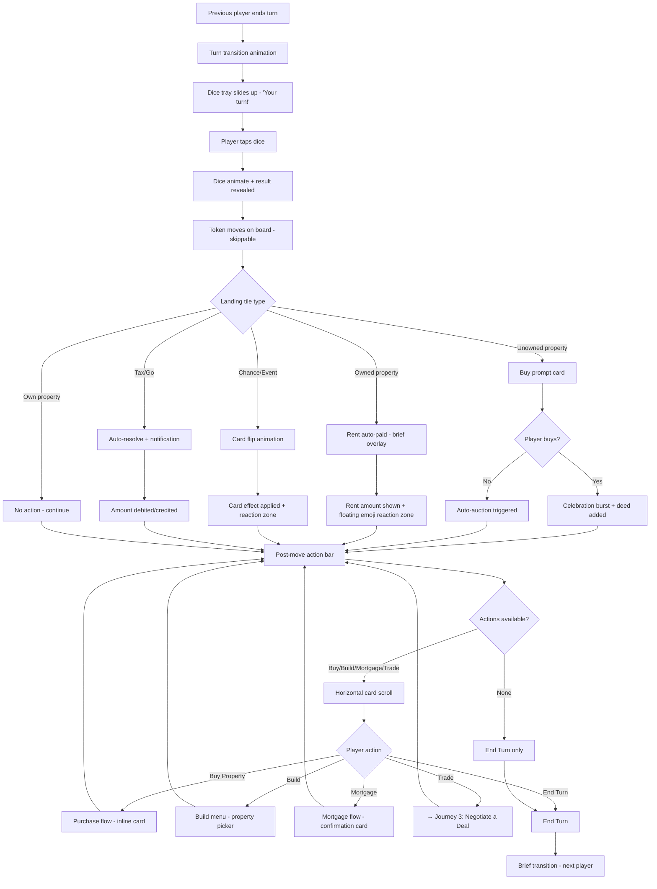
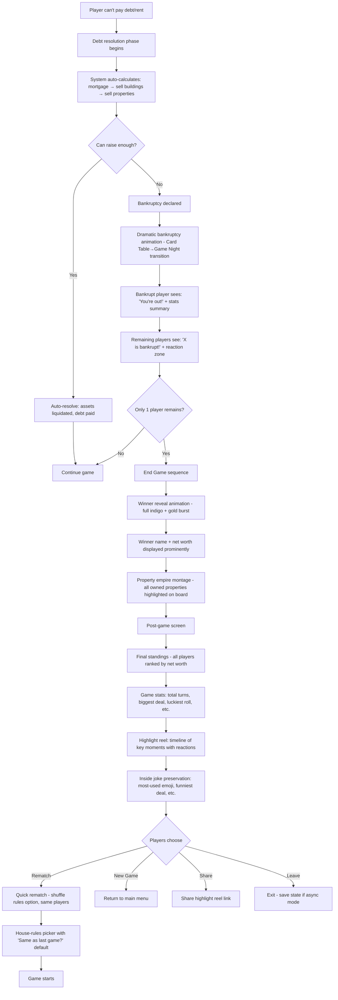

# UX Design Specification - property-tycoon-web

**Author:** Dangd
**Date:** 2026-05-17

---

## Executive Summary

### Project Vision

Property Tycoon is a Vietnamese real-estate trading board game — a social-first digital adaptation of Monopoly-style gameplay that maximizes connection and story while eliminating all administrative friction. It treats the rules engine as invisible infrastructure and elevates the human moments: negotiation, trash-talk, dramatic comebacks, and shared inside jokes.

### Target Users

Socially-driven casual gamers aged 16–45 — friends, families, couples, and roommates who use board games as an excuse to hang out. Groups of 3–6, usually with one "host" who initiates. A smaller strategic sub-group optimizes play but still refuses to manage the game manually. The unifying trait: they want a fun shared event, not a dry simulation.

### Key Design Challenges

1. **60-second cold start** — One-link invites, no accounts, instant play. Every extra tap costs players before they roll a die.
2. **Cross-device coherence** — Phone-as-controller + TV/tablet-as-board + desktop-for-remote must feel like one product.
3. **Social texture in digital** — Voice snippets, emoji reactions, negotiation UI must carry the banter and theater of physical play.
4. **Invisible admin** — All banking, math, rule enforcement is silent and automatic. The game proactively surfaces moments rather than expecting players to track state.
5. **Anti-stalemate pacing** — Speed Round voting, Quick Mode presets, forced auction timers to prevent mid-game player dropout.
6. **Graceful interruption** — Save states, async turn-by-turn, and highlight reels respect that life happens and stories are worth preserving.

### Design Opportunities

1. **One-link room invites** — No accounts, no app install barrier. Radically lower friction than any digital board game.
2. **Visual house-rules picker** — Toggle rules with playful slot-machine animations, turning setup into a fun group moment.
3. **Proactive deal prompts** — Game senses trade opportunities and nudges players at the right time.
4. **Voice/emoji reactions on deals** — Short audio clips or reaction bursts when trades close, preserving the "taunt factor."
5. **Speed Round voting** — Community-controlled pacing intervention gives players agency over game length.
6. **Async play mode** — One turn per day with push notifications — a unique differentiator no other Monopoly-like offers.
7. **Post-game highlight reel** — Best moments, stats, and inside jokes preserved for sharing and reminiscing.

## Core User Experience

### Defining Experience

The core loop is **Observe → React → Decide → Socialize**. The game engine handles the "Decide" layer invisibly so players spend their attention on the other three. The primary repeated action is contextual reaction: tapping to roll dice, confirming purchases, voting on deals — each a lightweight interaction that gets out of the way fast. The experience-defining action is the social moment *between* turns, not the mechanical input.

### Platform Strategy

- **Web-first** (React + Vite) — one responsive codebase serving mobile browser, desktop browser, and tablet
- **Mobile-primary** design philosophy — touch-first UI with larger hit targets, bottom-anchored action sheets, and portrait orientation as default
- **PWA-aspirational** — installable, push notifications for async play, offline resilience for save/load
- **Phone-as-controller + shared screen** is an aspirational future state; current design accommodates it by keeping game state on server and rendering board independently

### Effortless Interactions

1. **One-tap roll** — the single most frequent action must be instant, satisfying, and require no aiming
2. **Automatic banking** — all rent payments, change distribution, and house purchases happen silently with brief non-blocking animations
3. **Context-aware action panel** — only show valid actions for current phase/position; never make a player hunt for what they can do
4. **Proactive deal detection** — the game surfaces "Would you like to negotiate?" when trade conditions are favorable
5. **One-link join** — share a URL, land in the game. No install, no account, no lobby configuration confusion

### Critical Success Moments

1. **First 60 seconds** — host creates room, shares link, group is rolling dice. This is the "wait, that's it?" moment.
2. **First negotiation** — deal prompt appears, both sides tap to propose/accept, celebration animation plays. Players realize the game is *helping* them have fun.
3. **First speed round vote** — mid-game drag detected, game suggests Speed Round, group votes yes. Deadlock breaks in minutes instead of an hour.
4. **First save-and-resume** — someone leaves, saves state, restores later seamlessly. Trust earned.
5. **Post-game highlight reel** — stats, best moments, inside jokes. Players immediately want to rematch.

### Experience Principles

1. **Zero-admin gameplay** — if a banker would do it in physical play, the game does it silently. Players only make *interesting* decisions.
2. **Mobile-first, touch-first** — every interaction is designed for thumbs on glass. Desktop is an enhancement, not a fallback.
3. **Social amplification** — every game mechanic has a social expression. Deals have reactions. Rolls have celebrations. Bankruptcy has dramatic finales.
4. **Respect the clock** — never trap players. Always offer a path to a satisfying ending, whether through Speed Rounds, Quick Mode, or async continuation.
5. **Invisible complexity** — 48 tiles, phase machines, debt rules, mortgage math — all hidden behind clear, contextual UI that never exposes raw state.

## Desired Emotional Response

### Primary Emotional Goals

The dominant emotion is **Connected and Engaged** — Property Tycoon is social glue, not a solo activity. Secondary emotional targets: **Confidence** (players always know what they can do), **Delight** (surprise-and-delight moments at every social beat), and **Trust** (the game respects their time and never punishes them for UI ambiguity).

### Emotional Journey Mapping

| Stage | Dominant Emotion | Trigger |
|-------|-----------------|---------|
| Onboarding | Surprise + Relief | "Wait, we're already playing?" — one link, no accounts |
| During play | Belonging + Amusement | Inside jokes forming, emoji bursts, voice reactions |
| On their turn | Confidence + Agency | Action panel shows exactly what's possible, no rulebook needed |
| Being targeted | Playful rivalry | Rent hits hard but reaction UI softens it — groan becomes shared laugh |
| Mid-game drag | Agency + Optimism | Speed Round vote appears; deadlock feels solvable |
| Someone leaves | Trust + Respect | Auto-save, "We'll pick this up later" |
| Game ends | Triumph + Nostalgia | Dramatic winner reveal, highlight reel, immediate "rematch?" |

### Micro-Emotions

| Target | Avoid |
|--------|-------|
| Trust | Skepticism |
| Excitement | Anxiety |
| Delight | Mere satisfaction |
| Accomplishment | Frustration |
| Belonging | Isolation |

### Design Implications

- **Trust** → Predictable, consistent action panel. Clear turn indicators. No hidden state.
- **Excitement** → Satisfying dice animations, celebration bursts on purchases/deals, dramatic bankruptcy sequences.
- **Delight** → Easter eggs, playful micro-interactions (slot-machine house-rules picker), emoji/voice reactions.
- **Belonging** → Persistent group identity across sessions, inside joke preservation, highlight reels.
- **Confidence** → Context-aware UI that only shows valid actions; gentle rule clarifications when edge cases arise.

### Emotional Design Principles

1. **Celebrate everything** — every roll, purchase, deal, and bankruptcy gets a moment of theater
2. **Never punish confusion** — if a player doesn't know what to do, the UI has failed, not the player
3. **Leave a trail of stories** — the highlight reel and inside joke memory make play sessions memorable
4. **Respect real life** — saving, leaving, and resuming should feel like a natural pause, not a failure

## UX Pattern Analysis & Inspiration

### Inspiring Products Analysis

**Among Us** — Gold standard for social-game-as-hangout. Frictionless lobby creation, share-a-code, zero account barriers. Prioritizes communication and reaction (emergency meetings, quick votes) over complex mechanics. Expressive taunts and shared stories are the product.

**Skribbl.io / Gartic Phone** — Browser-based, drop-in/drop-out perfection. One-link join, no app download. Quick sessions, gallery of funny moments at the end. The invitation flow and meme-filled recap are the UX targets.

**Mario Kart 8 Deluxe** — Masterclass in competitive-yet-playful social shell. Easy pickup, visual cues for everything, emergent rivalry. Post-race highlight reel and automatic replays celebrate close finishes. The game amplifies reactions rather than just processing inputs.

### Transferable UX Patterns

| Source | Pattern | Adaptation for Property Tycoon |
|--------|---------|-------------------------------|
| Among Us | Share-a-code lobby, zero accounts | One-link room invites — host creates, shares URL, game starts |
| Among Us | Communication-first design | Voice snippets, emoji bursts, deal-proposal UI as first-class features |
| Skribbl.io | Post-game moment gallery | Highlight reel of best moments, stats, inside jokes after each match |
| Skribbl.io | No-app-install-required | Web-first PWA — play in browser, install optionally |
| Mario Kart | Post-race replays and drama | Theatrical winner reveal, dramatic bankruptcy sequences, Chance card flips |
| Mario Kart | Catch-up mechanics with visual flair | Speed Round voting feels like a power-up, not a punishment |

### Anti-Patterns to Avoid

*Derived from Monopoly by Marmalade Game Studio:*

1. **Unskippable animations** — inflates 90-minute game to 2+ hours. **Our rule:** every animation is skippable; speed over spectacle.
2. **Forced linearity** — one screen at a time, can't scan the board. **Our rule:** always-visible dashboard for board state, property info, and trade previews.
3. **Neglected house rules** — almost no customization. **Our rule:** house rules as first-class visual feature with live previews.
4. **No social texture** — canned phrases only, no voice, no memory of moments. **Our rule:** every game generates a story timeline of events and reactions.
5. **Clunky multiplayer lobby** — accounts, friend codes, broken reconnection. **Our rule:** link-based joining, no accounts, robust state recovery.

### Design Inspiration Strategy

**Adopt directly:** Among Us share-a-code lobby, Skribbl.io post-game gallery, Mario Kart dramatic replayable moments.

**Adapt for our context:** Voice/emoji reactions (from Among Us meetings → deal celebrations), browser-first PWA (from Skribbl.io), catch-up excitement (from Mario Kart items → Speed Round votes).

**Actively avoid:** Cinematic animation bloat, hidden information and forced screen-locking, rigid uncustomizable rule sets, sterile silent multiplayer with no social memory.

## Design System Foundation

### Design System Choice

**Custom design system on Tailwind CSS** — no third-party component library. The project already has this foundation in place with Tailwind CSS 4.2.4 (`@tailwindcss/vite`), Framer Motion 12.38.0 for animations, and Lucide React 1.14.0 for icons. Component libraries like MUI or Radix are optimized for CRUD applications, not game-specific interaction patterns (action panels, deal modals, dice overlays, auction timers).

### Rationale for Selection

1. **Game UI is unique** — standard component libraries don't have primitives for dice trays, property inspection panels, auction timers, or deal negotiation UIs
2. **Already in place** — no migration cost, no learning curve, team is productive
3. **Full visual control** — the game needs its own identity (Vietnamese real-estate theme, playful/social personality), not a generic Material or Ant Design look
4. **Tailwind enforces consistency** — design tokens through theme config provide guardrails without restricting creative freedom for game-specific components

### Implementation Approach

- **Tailwind CSS** as the token layer (colors, spacing, typography, shadows, breakpoints)
- **Custom components** built directly on Tailwind utility classes
- **Framer Motion** for all animated transitions (dice rolls, card flips, purchase celebrations, bankruptcy sequences)
- **Lucide React** for iconography
- **Game-specific design tokens** to be formalized: brand palette, building-level colors, tile state colors, player colors, phase indicator colors

### Customization Strategy

- Define a game-specific Tailwind theme extension for brand colors, building tier colors, and player identity colors
- Establish a component naming convention for game UI primitives (DiceTray, ActionPanel, PropertyCard, DealModal, etc.)
- Accessibility: evaluate Radix UI or React Aria for accessible primitives (modals, dialogs, popovers) if custom implementations prove insufficient
- Keep the system lightweight — no design token pipeline beyond Tailwind config

## Core User Experience

### Defining Experience

**"Take your turn and react to everyone else's."** The defining experience is the rhythm of spotlight moments alternating with social observation. During your turn, you feel confident, fast, and in control — the action panel shows exactly what you can do, and you do it in seconds. During others' turns, you're not waiting passively — you're scanning the board, previewing trade offers, sending emoji reactions, and planning your next move. The game's job is to make "your turn" feel like a power play and "their turn" feel like entertainment.

### User Mental Model

Players come in with Monopoly-shaped expectations: roll dice, move around a board, buy properties, collect rent, go bankrupt. What they *don't* expect is how fast and social a digital version can be. Their mental model is "board game night, but on our phones" — they expect the same social dynamics (trash-talk, deal-making, dramatic moments) without the physical friction (setup, math, rule debates). The UX must meet their board-game expectations while continuously surprising them with how much smoother and more fun digital can be.

### Success Criteria

1. **Turn completes in <10 seconds** for simple actions (roll-and-move with no decisions)
2. **Never waiting on animation** — every animation is skippable; the next action is always available immediately
3. **Always knowing what to do** — the action panel is never empty, never confusing; edge cases are clarified inline
4. **Social reaction is one tap away** — emoji/voice reaction accessible from anywhere during any player's turn
5. **Board state is always visible** — no screen-locking, no hidden information; the full board, property ownership, and player stats are persistently available

### Novel vs. Established Patterns

**Established patterns we adopt:**
- Turn-based gameplay with clear turn indicators (from every digital board game)
- Dice rolling as the primary action trigger (from physical Monopoly)
- Property cards for ownership display (from physical Monopoly)

**Novel patterns we introduce:**
- **Social sidebar always-on** — emoji/voice reactions visible during all turns, not gated behind a separate screen
- **Proactive deal prompts** — the game surfaces "Would you like to negotiate?" based on game state, rather than waiting for players to remember trading exists
- **Speed Round voting** — a community-controlled pacing mechanism with no physical analogue; the game senses stagnation and offers a path forward
- **Async turn notification** — push-based turn alerts for day-scale play; a completely new pattern for the genre

### Experience Mechanics

**1. Turn Initiation:** Turn indicator animates to the active player. Dice tray slides up from the bottom. "Your turn!" micro-animation plays. Other players see a passive "X is rolling..." indicator.

**2. Dice Roll:** One-tap anywhere on the dice tray. Dice animate (Framer Motion). Result displayed prominently. Token moves on the Phaser board — skippable with a tap.

**3. Landing Resolution:** Game auto-resolves: rent payment, property purchase prompt, Chance card flip, or tax. Each resolution is a brief, skippable overlay. The action panel updates to show valid next actions only.

**4. Post-Move Actions:** Player sees contextual options: Buy Property, Build, Mortgage, Trade, End Turn. Each action is a distinct card in a horizontally scrollable action bar. Invalid actions are hidden, not grayed-out.

**5. Social Layer:** During any phase, players can tap the emoji bar or hold to record a voice snippet. Reactions appear as floating bubbles near the triggering event (e.g., "😱" on the rent payment, "😂" on a Chance card). Voice snippets play on tap.

**6. Turn Completion:** "End Turn" button is prominent and always available. On tap, a brief transition animation passes the spotlight to the next player. The cycle repeats.

## Visual Design Foundation

### Color System — "Golden Hội An Night"

**Brand Palette:**

| Role | Color | Hex | Purpose |
|------|-------|-----|---------|
| Primary Warmth | Rich gold/amber | `#F5A623` → `#D48C0A` | Prosperity, CTAs, player money, premium districts |
| Secondary Earth | Terracotta clay | `#C97D60` | Property cards, house/hotel markers, mid-tier neighborhoods |
| Accent Jade | Deep green-teal | `#2D8B7A` | Growth, utilities, Chance cards, pass-go, safe zones |
| Deep Indigo | Night sky | `#1A1A3E` | Board backdrop (lacquer tray aesthetic), contrast surface |
| Text | Near-black | `#1E1E2C` | Body text on light surfaces (never pure black) |

**Celebration Accents:**

| Role | Color | Hex | Purpose |
|------|-------|-----|---------|
| Coral Pop | Pink | `#FF6B6B` | Deal confirmations, win sequences, delight micro-interactions |
| Electric Mint | Green | `#00D2A0` | Delight moments, positive outcome signals |

**Semantic Coding** (warmed/desaturated to avoid cold corporate feel):

| Signal | Color approach | Context |
|--------|---------------|---------|
| Danger/Debt | Warm red | Rent owed, bankruptcy warning |
| Income/Gain | Warm green | Rent collected, passing Go |
| Chance/Event | Warm yellow | Chance cards, random events |
| Auction/Bid | Cool blue | Auction phase indicators |

**Tile Category Tints** (subtle background for at-a-glance board scanning):

| Category | Tint |
|----------|------|
| Premium land | Gold |
| Standard land | Terracotta |
| Utility/Railroad | Jade |
| Special tiles | Indigo |

### Typography System

**Primary Typeface:** **Be Vietnam Pro** — modern, friendly sans-serif with excellent Vietnamese diacritic support.

**Fallback Stack:** `"Be Vietnam Pro", "Inter", system-ui, sans-serif`

**Type Scale:**

| Role | Weight | Size | Context |
|------|--------|------|---------|
| Property card headings | 700 (Bold) | 1.25rem | Property names on cards |
| Body / button labels | 500–600 | 1rem | Action buttons, labels |
| Money/ledger numbers | Tabular figures | 1rem | Clean alignment in financial displays |
| Small labels | 500 | 0.875rem | Tile names, secondary info |
| Micro text | 400 | 0.75rem | Phase indicators, timestamps |

**Requirements:**
- Vietnamese diacritics must render without clipping (`ă`, `â`, `ê`, `ô`, `ơ`, `ư`, tone marks)
- Tabular lining figures for money columns
- No serif — clarity and speed over ornamentation
- All text minimum 14px for diacritic-heavy content

### Spacing & Layout Foundation

**Layout approach:** Mobile-first portrait orientation. Bottom-anchored action area, top-anchored player status bar. Phaser board canvas occupies center ~60% of viewport. Overlays slide up as card-like sheets from the bottom.

**Key zones:**
1. **Top bar** — Turn indicator + player status chips (horizontal scroll)
2. **Board canvas** — Phaser-rendered, fills available center space
3. **Action drawer** — Bottom-anchored, slides up with contextual action cards
4. **Emoji/reaction bar** — Always-visible thin strip above action drawer

**Grid:** 4-column flexible grid for player info cards; 8px base spacing unit.

### Accessibility Considerations

- All text/action combinations meet WCAG AA minimum (4.5:1 normal, 3:1 large text)
- Minimum 44×44px touch targets for all interactive elements (WCAG 2.5.5)
- Semantic signals are never color-alone — icons and labels always accompany color coding
- Respect `prefers-reduced-motion` — Framer Motion animations have reduced alternatives
- All animations have tap-to-skip mechanism (also serves general usability)

### Visual Texture & Motif

- **Background patterns:** Subtle repeating geometric motifs inspired by Đông Hồ folk art or tile mosaics at 5% opacity on card backs, loading screens, and board non-playable area
- **Shadows & depth:** Soft diffused shadows (lantern-light quality) rather than harsh drop shadows; UI panels with slight paper texture or frosted glass effect
- **Iconography:** Simple rounded icons with hand-drawn warmth (ink brush aesthetic, cleaned up for mobile) for actions like deal, auction, build

## Design Direction Decision

### Design Directions Explored

Three directions were evaluated:

1. **"Game Night"** — Immersive, dramatic, full-bleed board with translucent glass-morphism overlays. Best for TV casting and the "event" feel. Risk: heavy on mobile, reduced readability.

2. **"Card Table"** — Light, tactile, paper-textured. Board in a card-like frame, action cards fan out like a poker hand. Warm cream/terracotta base. Best for mobile-primary and the "sitting around a table" atmosphere.

3. **"Dashboard"** — Data-rich, split-screen efficiency. Persistent stats and property ledger alongside the board. Best for strategic players who want information density. Risk: less social warmth, may feel like a tool.

### Chosen Direction

**"Card Table" as foundation, layered with "Game Night" drama for celebration moments.**

The Card Table direction provides the right mobile-first, tactile, social-warmth baseline. Its card-based action system (fanning out from bottom, each action a distinct card with paper texture) maps naturally to touch interaction and feels like handling physical property cards. The warm cream/terracotta base complements the Golden Hội An Night palette.

Game Night elements are selectively applied for high-impact moments: dramatic center-screen dice rolls with particle effects, full-bleed celebration overlays on deals and bankruptcies, and the deep indigo backdrop during the "Your turn!" spotlight transition. This keeps the baseline light and usable while making key moments feel theatrical.

### Design Rationale

1. **Mobile-first alignment** — Card Table's card-based interactions are inherently thumb-friendly; cards fan horizontally, are swipeable, and have large touch targets
2. **Social warmth** — Paper textures, soft shadows, and warm tones create the "game night at a friend's house" atmosphere, not a cold digital tool
3. **Vietnamese cultural resonance** — Card Table's tactile quality pairs naturally with Đông Hồ folk art motifs and the lantern-light shadow treatment
4. **Selective drama** — Game Night overlays only activate for moments that earn spectacle (dice, deals, bankruptcies, wins), avoiding Marmalade's "everything is cinematic" anti-pattern

### Implementation Approach

- **Baseline UI:** Opaque card components with subtle paper texture, warm cream backgrounds, soft lantern-light shadows (Card Table)
- **Action drawer:** Horizontal scrollable cards fanning from bottom, each card representing one valid action with icon + label
- **Dice:** Center-screen dramatic overlay with particle effects and satisfying physics (Game Night)
- **Celebrations:** Full-bleed indigo backdrop with coral/mint accent bursts for deal confirmations, bankruptcies, and wins (Game Night)
- **Turn transition:** Brief indigo spotlight animation when turn changes (Game Night), then back to Card Table baseline

## User Journey Flows

### Journey 1: Create & Join a Game

**Goal:** Host creates a room, shares a link, group is playing in under 60 seconds. No accounts, no installs, no confusion.

```mermaid
flowchart TD
    A[Landing Screen] --> B{First time?}
    B -->|Yes| C[Quick tutorial overlay - 3 cards, skippable]
    B -->|No| D[Main menu]
    C --> D
    D --> E{Player action}
    E -->|Create Game| F[Host configures game]
    E -->|Join Game| G[Paste/scan invite link]
    
    F --> F1[Visual house-rules picker]
    F1 --> F2[Select Quick or Classic mode]
    F2 --> F3[Room created - share link appears]
    F3 --> F4[Copy link / QR code]
    F4 --> H[Waiting room - see players join]
    
    G --> G1{Valid link?}
    G1 -->|Yes| G2[Enter display name]
    G1 -->|No| G3[Show error + retry prompt]
    G3 --> G
    G2 --> H
    
    H --> H1{All ready?}
    H1 -->|Host starts| I[Game begins - board loads]
    H1 -->|Not yet| H2[Players can customize token/color]
    H2 --> H
    
    I --> J[🎉 "Let's Play!" celebration]
```

**Key UX decisions:**
- No account creation — display name only, stored in session
- Invite link is a URL + optional QR code for in-person sharing
- House-rules picker is visual (slot-machine toggle animation) — not dropdown menus
- Waiting room shows live player list with token color previews
- Host has "Start Game" button; players see "Waiting for host..."

**Edge cases:**
- Invalid/expired link → clear error with option to create new game
- Host disconnects before start → promote next player to host
- Player disconnects from waiting room → remove from list after 30s timeout

---

### Journey 2: Take a Turn

**Goal:** Complete a turn in seconds for simple actions. Never leave the player wondering what to do. The UI is a guide, not a gate.



**Key UX decisions:**
- Dice roll is one tap anywhere on tray — no aiming at a specific button
- Token movement is skippable with a single tap
- Action bar only shows valid actions (hidden, not grayed-out)
- Auto-resolve all financial transactions without requiring confirmation
- "End Turn" is always prominent and available

**Edge cases:**
- Debt scenario: prompt to mortgage/sell before End Turn is available
- Turn timeout (online mode): countdown timer visible, auto-end with warning at 10s
- Network delay (online): dice roll shows local animation immediately, server validates asynchronously
- Player has zero valid actions: End Turn is the only card shown

---

### Journey 3: Negotiate a Deal

**Goal:** Two or more players negotiate a property trade. The UI facilitates, the social layer amplifies. Feels like a conversation, not a form.

```mermaid
flowchart TD
    A[Player selects Trade from action bar] --> B{Trade initiated by}
    B -->|Proactive prompt| C[Game detects trade opportunity]
    B -->|Manual| D[Player taps Trade]
    
    C --> C1[System: 'Good time to negotiate?' card]
    C1 --> C2{Player accepts?}
    C2 -->|Yes| D
    C2 -->|No| C3[Dismiss - return to action bar]
    
    D --> E[Select trade partner(s)]
    E --> F[Deal Table opens]
    
    F --> F1[Split screen: Your assets | Their assets]
    F1 --> F2[Player adds properties/cash to offer]
    F2 --> F3[Player adds requested properties/cash]
    F3 --> F4[Preview: 'You give X, you receive Y']
    
    F4 --> G{Satisfied with proposal?}
    G -->|Edit| F2
    G -->|Send| H[Proposal sent to partner]
    
    H --> I[Partner receives Deal notification]
    I --> I1[Partner reviews proposal]
    I1 --> I2[Partner can: Accept / Counter / Decline]
    
    I2 -->|Accept| J[🤝 Deal animation + voice/emoji reactions available]
    I2 -->|Counter| K[Partner modifies terms]
    I2 -->|Decline| L[Decline with optional emoji reaction]
    
    K --> K1[Original player reviews counter]
    K1 --> K2{Response?}
    K2 -->|Accept| J
    K2 -->|Counter back| K
    K2 -->|Walk away| L
    
    J --> J1[Assets transferred automatically]
    J1 --> J2[Reaction zone: hold for voice, tap for emoji]
    J2 --> J3[Deal recorded to game timeline]
    J3 --> M[Return to action bar]
    
    L --> L1[Deal closed - return to action bar]
```

**Key UX decisions:**
- Proactive deal detection: game analyzes state after each turn and surfaces "Good time to negotiate?" when favorable conditions exist (e.g., two players own properties in same color group)
- Split-screen deal table with drag-to-add property cards on desktop, tap-to-toggle on mobile
- Live preview of "You give X, you receive Y" updates as terms change
- Voice snippet recording (hold microphone button) and emoji burst are available at deal acceptance
- All deals are recorded to the game timeline for the post-game highlight reel

**Edge cases:**
- Multi-party trades (3+ players): extend split screen to horizontal scroll of participant columns
- Player leaves during negotiation: deal auto-cancels, assets return to original owners
- Trade would bankrupt a player: warning displayed before confirmation
- Turn timer during negotiation: timer pauses while deal table is open

---

### Journey 4: Bankruptcy & End Game

**Goal:** Dramatic, satisfying conclusion. Winner feels triumphant. Losers feel entertained, not humiliated. Everyone wants to rematch.



**Key UX decisions:**
- Bankruptcy is automatic — the system liquidates assets in optimal order (mortgage → sell buildings → sell properties) without player input
- The bankrupt player gets a dramatic but respectful exit animation, not a humiliating one
- Winner reveal transitions from Card Table to full Game Night: deep indigo backdrop, gold particle burst, property empire montage
- Highlight reel is auto-generated from the game timeline (deals, reactions, key moments) — no manual curation needed
- "Rematch" is the most prominent option; it preserves the group, shuffles rules optionally, and starts immediately

**Edge cases:**
- Multiple players bankrupt in one turn (chain reaction): process sequentially with individual animations, then check for winner
- Winner disconnects before end sequence: auto-save, notify remaining players, offer to resume later
- Draw/tie (identical net worth): co-winners celebrated together, coin-flip animation for tiebreaker stat
- Player rage-quits during bankruptcy: treat as standard disconnect — auto-liquidate, remove from game

## Component Strategy

### Design System Components

**Foundation (existing):** Tailwind CSS 4.2.4 utility classes, Framer Motion 12.38.0 for animations, Lucide React 1.14.0 for icons. No third-party component library — all components are custom-built on this foundation. Phaser 4 renders the board canvas via `BoardScene`.

**Reusable primitives to extract from existing code:**
- Modal/Dialog — for overlays, confirmations, card flip reveals
- Button — three variants: Primary (gold `#F5A623`), Secondary (terracotta `#C97D60`), Danger (warm red)
- PlayerChip — player status indicator with avatar color, cash display, turn highlight

### Custom Components — MVP Priority

These 6 components are the minimum needed for the four critical user journeys to function and the social experience to be felt.

| # | Component | Journey | Purpose |
|---|-----------|---------|---------|
| 1 | **DiceTray** | J2 | One-tap dice roll (anywhere on tray), animated result (Framer Motion), skippable token movement |
| 2 | **ActionCardBar** | J2 | Horizontal scrollable cards, contextually filtered (hidden, not grayed-out), each card = one valid action |
| 3 | **PropertyCard** | J2, J3 | Property deed display: name, building level (1-5), mortgage status, rent table, owner color |
| 4 | **TurnIndicator** | J2 | Animated spotlight transition, active player name/color, countdown timer (online mode) |
| 5 | **EmojiReactionBar** | J2, J3 | Always-visible emoji strip (5 frequent reactions), hold-to-record voice snippet button |
| 6 | **WaitingRoom** | J1 | Live player list with token color preview, host-only Start Game button, invite link + QR code display |

### Custom Components — Post-MVP

These components enhance the experience significantly but have simpler fallbacks for initial release.

| # | Component | Journey | Purpose | Fallback |
|---|-----------|---------|---------|----------|
| 7 | **DealTable** | J3 | Split-screen trade negotiation, tap-to-toggle asset selection, live preview of terms | Simple modal with checkboxes |
| 8 | **HouseRulesPicker** | J1 | Visual slot-machine toggle for rule customization with live previews | Basic toggle switches |
| 9 | **BankruptcyOverlay** | J4 | Full-bleed Game Night dramatic exit with stats summary | Simple notification card |
| 10 | **WinnerReveal** | J4 | Gold burst animation, property empire board montage, final standings | Simple standings list |
| 11 | **HighlightReel** | J4 | Auto-generated timeline of key moments with embedded reactions | Plain stats summary |
| 12 | **PostGameScreen** | J4 | Standings, stats, highlight reel, prominent Rematch button | Simple result modal |

### Component Implementation Strategy

**Build order:** Components are prioritized by the user journey they unlock. MVP components enable a full playable game from join to bankruptcy. Post-MVP components layer on the social spectacle.

**Conventions:**
- All components are PascalCase named exports (existing convention)
- Each component in its own file within `client/src/ui/` or appropriate feature directory
- Tailwind classes directly in JSX — no CSS modules or styled-components
- Framer Motion `motion.div` wrappers for all animated elements
- Lucide React icons for all iconography
- Accessibility: all interactive elements have `aria-label`, minimum 44×44px touch targets, keyboard navigable

**State management:**
- Game state from `useGameStore` selectors (minimal leaf selection)
- UI-only state (modal open, selected trade assets) from `useUIStore`
- Animation queue via `useUIStore.animationQueue` drain mechanism (existing pattern)
- EventBus for cross-component communication (e.g., `tile:clicked` → PropertyCard opens)

### Implementation Roadmap

**Phase 1 — Core Loop (Journey 1 + 2):**
DiceTray → ActionCardBar → TurnIndicator → WaitingRoom → PropertyCard

**Phase 2 — Social Layer (Journey 2 + 3):**
EmojiReactionBar → DealTable (fallback: simple modal) → HouseRulesPicker (fallback: toggles)

**Phase 3 — Spectacle (Journey 4):**
BankruptcyOverlay → WinnerReveal → PostGameScreen → HighlightReel

## UX Consistency Patterns

### Action Hierarchy

Game actions replace traditional form buttons entirely. Every player decision is expressed through the ActionCardBar, not through menus or dropdowns.

| Priority | Role | Visual | Context |
|----------|------|--------|---------|
| Primary | End Turn | Gold `#F5A623`, bold, always rightmost card | Always available, most frequent action |
| Primary | Roll Dice | Full-width dice tray, not a card | Center-screen, one-tap-anywhere |
| Action | Buy, Build, Mortgage, Trade | Terracotta `#C97D60` cards, icon + label | Horizontal scroll, contextually filtered |
| Danger | Sell, Mortgage (distressed) | Warm red card | Only appears during debt resolution |
| Social | Emoji, Voice | Coral pop `#FF6B6B`, always-visible strip | Available during all phases, all players' turns |

**Rules:**
- Never show invalid actions (grayed-out) — hide them entirely
- Action cards fan from bottom, horizontal scroll, most-likely action first
- "End Turn" is always the rightmost card, never hidden
- Dice tray consumes the full lower third during roll phase, then collapses into ActionCardBar

### Overlay & Sheet Patterns

All non-board UI slides up from the bottom as card-like sheets. This is the consistent navigation model — there is no traditional nav bar, no hamburger menu.

| Sheet Type | Trigger | Animation | Dismiss |
|------------|---------|-----------|---------|
| Dice Tray | Turn start | Slide up + scale (spring) | Tap anywhere on dice |
| Action Card Bar | Post-roll | Slide up (ease-out) | Select action or End Turn |
| Property Card | Tap tile or own property list | Slide up card with building level indicator | Swipe down or tap X |
| Deal Table | Select Trade action | Split-screen slide up | Walk away or deal completes |
| Auction Panel | Property not bought | Slide up with countdown timer | Timer expires or bid resolves |
| Notification | Event (rent paid, chance drawn) | Brief slide-up toast, auto-dismiss 2s | Auto or tap |

**Rules:**
- Only one sheet at a time — opening a new sheet dismisses the current one
- All sheets have a drag handle (visual affordance for swipe-to-dismiss on mobile)
- Sheets never obscure the board entirely — max 50% viewport height
- Desktop: sheets are centered modals instead of bottom sheets, but same card aesthetic

### Feedback & Celebration Patterns

Every game event has a feedback signature. The intensity scales with the event's emotional weight.

| Event | Feedback Type | Duration | Skippable |
|-------|--------------|----------|-----------|
| Dice roll | Physics animation + result display | 1s | Tap to skip |
| Rent paid | Brief toast (amount, recipient) | 2s auto | Tap to dismiss |
| Property bought | Green pulse on tile + deed slide-up | 1.5s | Tap to dismiss |
| Chance card | Card flip animation (Framer Motion) | 2s | Tap to skip |
| Deal accepted | Coral/mint burst + handshake animation | 3s | Tap to dismiss |
| Bankruptcy | Full Game Night transition, indigo overlay | 4s | Tap to skip (but rarely will) |
| Winner reveal | Gold particle burst + empire montage | 5s | Tap to skip |
| Error/invalid | Subtle shake + brief red flash | 0.5s | Auto |

**Rules:**
- Every animation is skippable — single tap advances to next state
- Respect `prefers-reduced-motion`: replace physics/burst with simple opacity transitions
- Animation queue via `useUIStore.animationQueue` drain mechanism (existing pattern — prevents overwrites)
- Never chain more than 2 animations without offering skip

### Loading & Connection States

Game-specific states that must feel like the game, not a web app buffering.

| State | Visual | Duration Goal |
|-------|--------|---------------|
| Creating room | Indigo screen + pulsing lantern icon + "Đang tạo phòng..." | <2s |
| Joining room | Indigo screen + connecting dots + player name entry | <3s |
| Waiting for players | WaitingRoom component (player list, invite link) | Until host starts |
| Reconnecting | Semi-transparent overlay + "Đang kết nối lại..." | <5s ideal, <30s timeout |
| Turn timeout warning | TurnIndicator countdown pulses red at 10s | 10s |
| Server error | Full-screen card: "Mất kết nối" + retry button | Until resolved |

**Rules:**
- Never show a blank white screen during loading — always indigo branded backdrop
- All loading text in Vietnamese (per project convention: game logs are Vietnamese)
- Reconnection: preserve UI state, show overlay, auto-retry 3 times, then offer manual retry
- Timeout: visible countdown, not hidden — player should feel agency, not surprise

### Animation Rules

Derived from anti-pattern analysis (Marmalade) and project context (Framer Motion + animation queue).

| Rule | Rationale |
|------|-----------|
| **Always skippable** | Single tap advances past any animation. Learned from Marmalade's unskippable bloat. |
| **Max 300ms for functional UI** | Action transitions (dice result, action bar appear) — speed over spectacle |
| **Up to 3s for celebrations** | Deals, bankruptcies, winner — earns the time because it's the highlight |
| **Respect prefers-reduced-motion** | All Framer Motion animations check `prefers-reduced-motion` media query |
| **Animation queue drain** | Use existing `useUIStore.animationQueue` — never overwrite in-progress animation state |
| **No animation loops** | Everything resolves to a static state; no spinning, no pulsing indefinitely |
| **Physics for dice only** | Only dice use spring/gravity physics; all other animations are opacity/transform |

## Responsive Design & Accessibility

### Responsive Strategy

**Mobile-first, portrait-primary.** The board always fills center screen. The action area is always bottom-anchored. Desktop is an enhancement with side-by-side layouts, not a redesign.

| Breakpoint | Width | Layout |
|------------|-------|--------|
| Mobile | < 768px | Portrait, bottom sheets, full-width board, single-column action cards |
| Tablet | 768px – 1023px | Landscape or portrait, wider board, 2-column action grid possible |
| Desktop | ≥ 1024px | Side panel for player stats + property ledger, centered board, modals instead of bottom sheets |

**Key responsive rules:**
- Board canvas scales proportionally to fill available center space (Phaser scale manager)
- Action cards stack vertically on mobile, fan horizontally on tablet+
- Player status chips collapse from full cards to compact chips below 480px
- PropertyCard is full-width sheet on mobile, centered modal on desktop
- DealTable is stacked vertically on mobile, side-by-side on desktop

### Breakpoint Strategy

Tailwind's default breakpoints (`sm: 640px`, `md: 768px`, `lg: 1024px`) are sufficient. No custom breakpoints needed. All new components use the `md:` and `lg:` prefixes for layout changes.

**Testing targets:**
- Small mobile: 375px (iPhone SE)
- Standard mobile: 390px (iPhone 14)
- Large mobile: 430px (iPhone 14 Pro Max)
- Tablet portrait: 768px (iPad Mini)
- Tablet landscape: 1024px (iPad)
- Desktop: 1440px+

### Accessibility Strategy

**Target: WCAG 2.1 Level AA** — the industry standard for good UX.

**Key requirements already met by design:**
- 44×44px minimum touch targets (all interactive elements)
- 4.5:1 contrast ratio for normal text, 3:1 for large text
- Color never the sole indicator — icons and labels always accompany semantic colors
- All animations skippable with single tap
- `prefers-reduced-motion` respected via Framer Motion `useReducedMotion()`

**Additional requirements for implementation:**
- All interactive elements: `aria-label` on icon-only buttons, `role` attributes on custom components
- Turn indicator: `aria-live="polite"` region announcing "Your turn" / "X's turn"
- Game events: `aria-live="assertive"` region for critical events (bankruptcy, auction starting)
- Keyboard navigation: Tab through action cards, Enter to select, Escape to dismiss sheets
- Focus management: focus moves to new sheet when opened, returns to trigger when dismissed
- Screen reader: property card reads building level + rent table, deal table reads offer summary

### Testing Strategy

**Automated:** Vitest + axe-core for component-level accessibility assertions. Lighthouse CI for WCAG compliance scoring per PR.

**Manual:** Keyboard-only navigation test pass on every new component. Screen reader test (NVDA on Windows, VoiceOver on Mac) for journey-critical flows.

**Visual:** Color blindness simulation (protanopia, deuteranopia, tritanopia) for all color-coded elements. 200% zoom test for layout stability.

### Implementation Guidelines

- Use semantic HTML where possible (`<button>`, not `<div onclick>`)
- Framer Motion `useReducedMotion()` hook for all animated components
- Tailwind `sr-only` utility for visually hidden screen-reader text
- `focus-visible:` ring styles on all interactive elements (Tailwind default)
- Test at 375px viewport before marking any component complete

